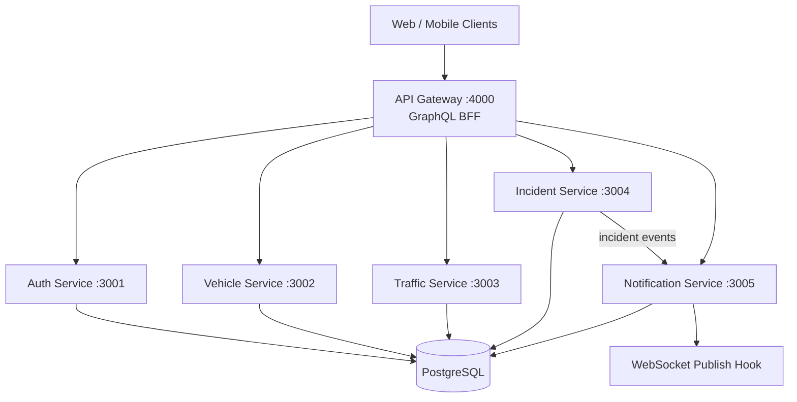
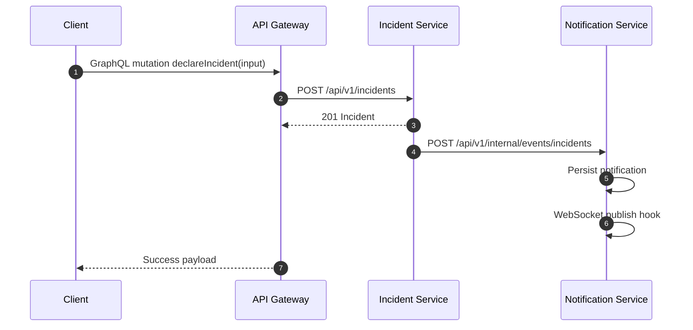
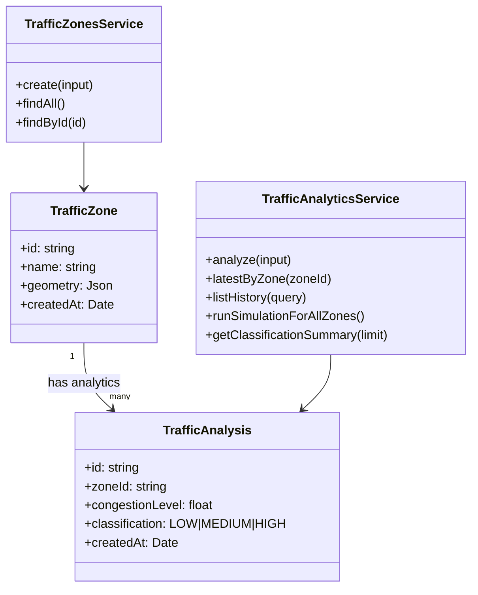

# UML Diagrams

## 1) High-Level Component Diagram

```mermaid
graph TD
  Client[Web / Mobile Clients] --> Gateway[API Gateway :4000\nGraphQL BFF]

  Gateway --> Auth[Auth Service :3001]
  Gateway --> Vehicle[Vehicle Service :3002]
  Gateway --> Traffic[Traffic Service :3003]
  Gateway --> Incident[Incident Service :3004]
  Gateway --> Notification[Notification Service :3005]

  Auth --> Postgres[(PostgreSQL)]
  Vehicle --> Postgres
  Traffic --> Postgres
  Incident --> Postgres
  Notification --> Postgres

  Incident -->|incident events| Notification
  Notification --> WS[WebSocket Publish Hook]
```

## 2) Sequence Diagram — Incident to Notification Flow

```mermaid
sequenceDiagram
  autonumber
  participant C as Client
  participant G as API Gateway
  participant I as Incident Service
  participant N as Notification Service

  C->>G: GraphQL mutation declareIncident(input)
  G->>I: POST /api/v1/incidents
  I-->>G: 201 Incident
  I->>N: POST /api/v1/internal/events/incidents
  N->>N: Persist notification
  N->>N: WebSocket publish hook
  G-->>C: Success payload
```

## 3) Class Diagram — Traffic Domain (Simplified)

```mermaid
classDiagram
  class TrafficZone {
    +id: string
    +name: string
    +geometry: Json
    +createdAt: Date
  }

  class TrafficAnalysis {
    +id: string
    +zoneId: string
    +congestionLevel: float
    +classification: LOW|MEDIUM|HIGH
    +createdAt: Date
  }

  class TrafficZonesService {
    +create(input)
    +findAll()
    +findById(id)
  }

  class TrafficAnalyticsService {
    +analyze(input)
    +latestByZone(zoneId)
    +listHistory(query)
    +runSimulationForAllZones()
    +getClassificationSummary(limit)
  }

  TrafficZone "1" --> "many" TrafficAnalysis : has analytics
  TrafficZonesService --> TrafficZone
  TrafficAnalyticsService --> TrafficAnalysis
```
